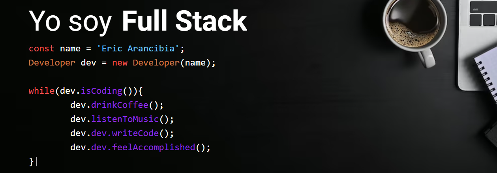

<h2 align="left">Hey there! I'm Eric Arancibia</h2>

### 👨🏻‍💻 &nbsp;About Me
🎓 &nbsp;I'm a full stack javascript development student trainee, soon to obtain my certificate. Academia Desafío Latam - Talento Digital para Chile.\
📍 &nbsp; I'm live in Chili.\
💡 &nbsp;I like to explore new technologies and develop software solutions and quick hacks.\
✍️ &nbsp;In my free time, I practice hobbies such as graphic design and playing video games.\
✉️ &nbsp;You can shoot me an email at es.arancibia@gmail.com! I'll try to respond as soon as I can.\
👉 &nbsp;I am a newly trained fullstack developer, passionate about technology and with a solid foundation in HTML, CSS, JavaScript and Node.js. Although I have no professional experience, working on personal projects and contributions to open source demonstrates my ability to learn quickly and adapt. I am excited for the opportunity to contribute my skills and grow professionally!.\
📄 &nbsp;Please have a look at my [Resume](https://drive.google.com/file/d/1v8r1QfWAwzhQ845yTZv6UMuPF1DvvyVQ/view?usp=sharing) for more details about me.\

### 🛠 &nbsp;Tech Stack

&nbsp;
&nbsp;
&nbsp;
&nbsp;
&nbsp;
&nbsp;
&nbsp;
&nbsp;
&nbsp;

### 🗃 &nbsp;Databases

&nbsp;

### 🧰 &nbsp;Version Controll & Tools 

&nbsp;
&nbsp;
&nbsp;
&nbsp;
&nbsp;
&nbsp;
&nbsp;
&nbsp;
&nbsp;

### ⚙️ &nbsp;GitHub Analytics

  
  

  

### 🤝🏻 &nbsp;Connect with Me

